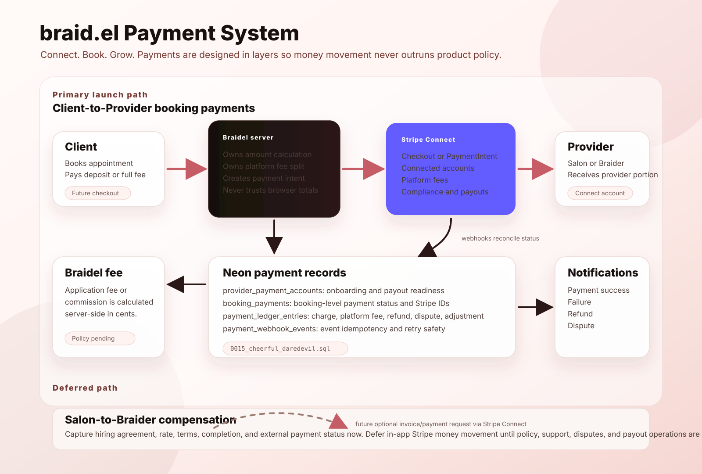

# Braidel Payment System Architecture

> Status: Workstream 5 foundation is implemented. Stripe checkout, Stripe
> Connect onboarding, live payment capture, refunds, disputes, and payouts are
> intentionally inactive until payment policy and QA are complete.

## Purpose

Braidel needs payments for two different marketplace relationships:

1. **Client-to-Provider booking payments**: Clients pay Salons or Braiders for
   appointments and Braidel may collect a platform fee.
2. **Salon-to-Braider hiring compensation**: Salon owners may compensate
   Braiders after an application, match, shift, event, or service agreement.

These are related, but they should not launch at the same maturity level.

## Recommended Payment Strategy

### Launch Track: Client Booking Payments

This is the primary Workstream 5 target. It should be implemented first because
the flow is clearer:

- Client requests or confirms an appointment.
- Braidel calculates the amount and any platform fee on the server.
- Stripe collects payment.
- Stripe Connect routes the provider portion to the connected Salon or Braider.
- Stripe webhooks update Braidel's local payment status and ledger.
- Braidel records auditable payment history for support, refunds, and disputes.

The current schema foundation already supports this track through:

- `provider_payment_accounts`
- `booking_payments`
- `payment_ledger_entries`
- `payment_webhook_events`
- `src/lib/payments-domain.ts`

### Deferred Track: Salon-to-Braider Payments

Salon-to-Braider compensation is important, but Braidel should not manage the
money movement at launch.

Recommended first version:

- Capture the hiring agreement inside Braidel.
- Store agreed rate, compensation type, service/shift dates, notes, and status.
- Allow both parties to mark the work and payment as externally handled.
- Keep optional proof or notes such as "paid by Zelle", "cash", "invoice sent",
  or "paid outside Braidel".

Recommended later version:

- Add optional in-app payment requests or invoices.
- Let Braiders request payment from Salon owners through Braidel.
- Let Braidel collect a service fee when the transaction is paid in-app.
- Add dispute, refund, tax, payout, and support policies before making this a
  default flow.

This avoids making Braidel act like payroll, escrow, or a dispute-heavy
financial operator before the marketplace has mature policy and support
coverage.

## Stripe Connect Role

Stripe Connect is the payment layer for marketplace money movement. In Braidel,
it is intended to support:

- Connected payment accounts for Salons and Braiders.
- Server-owned checkout or payment creation.
- Platform fees or commissions.
- Provider payout readiness tracking.
- Stripe webhook reconciliation.
- Refund, dispute, and adjustment history.

Braidel should never trust client-supplied payment amounts, fee amounts, payout
destinations, or payment status. Those must be created and reconciled from
authenticated server code and Stripe webhooks.

## Architecture Diagram

## Workstream 5 Close Criteria Before QA

The documentation/design close-out for Workstream 5 is:

- Payment schema foundation exists and is migrated.
- Payment-domain helper logic exists for integer-cent fee splits.
- Product boundary is documented.
- Stripe activation remains gated.
- Salon-to-Braider agreement capture is documented as required future product
  functionality.
- Salon-to-Braider money movement is explicitly deferred until policy maturity.

## Next QA Scope

QA should validate the current foundation boundaries, not live payments:

- Confirm the app still builds and existing booking/review flows are unaffected.
- Confirm the new migration is present in the migration journal.
- Confirm the four payment tables exist in development Neon.
- Confirm Stripe environment variables are documented but not required for
  normal local app browsing yet.
- Confirm no checkout, Connect onboarding, refund, payout, or webhook route is
  exposed as a live user flow.

## Deferred Before Production

Before launching live payments, define and approve:

- Platform fee basis points.
- Deposit vs. full payment rules.
- Cancellation and no-show policy.
- Refund windows and refund responsibility.
- Provider payout timing.
- Charge/dispute ownership.
- Stripe Connect account type and onboarding UX.
- Payment support playbook.
- Reconciliation and operational monitoring.
